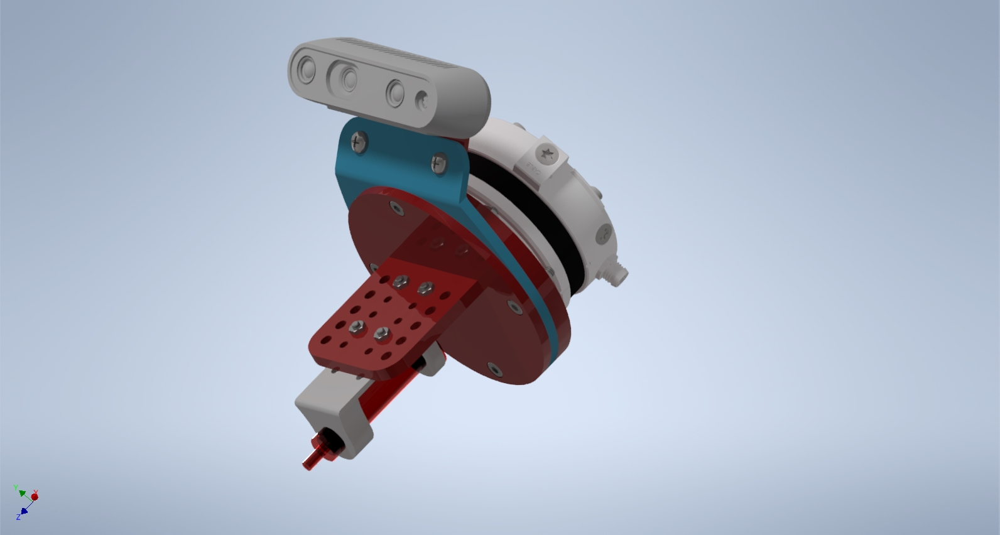

# [Under Development]
### MT - UR3 Gripper

```javascript
Software
```
```
Autodesk Inventor Proffesional 2020
PrusaSlicer 2.3.1
```
### Example


### Bill Of Parts 
* 2ml_syringe
* extension_1_V2
* extension_2_V2
* holder_1_V1
* holder_2_V1
* holder_3_V1
* holder_4_V1
* Intel-Realsense D435
* Hex-e sensor

### Bill Of Materials 
Number | ISO | Parameters
------------ | ------------- | -------------
4x | DIN EN ISO 4762 | M6x10
4x | DIN EN ISO 4762 | M4x16
4x | DIN EN ISO 4762 | M4x20
2x | EN ISO 7045H | M4x12
2x | EN ISO 7045H | M3x5
4x | EN ISO 7045H | M3x14
4x | EN 24035 | M3
8x | EN 24035 | M4

### Note
* Recommended torque for both M3 mounting points is 0.4Nm Intel Realsense D435i.

### References
* [D435i Spec.](https://www.intelrealsense.com/depth-camera-d435i/)
* [Faculty of Mechanical Engineering BUT](https://www.fme.vutbr.cz/en)
